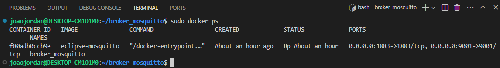
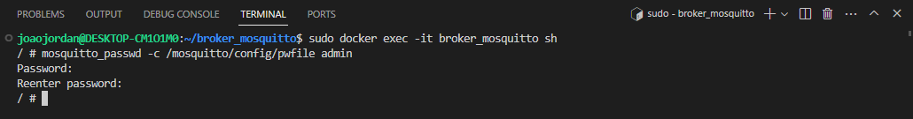
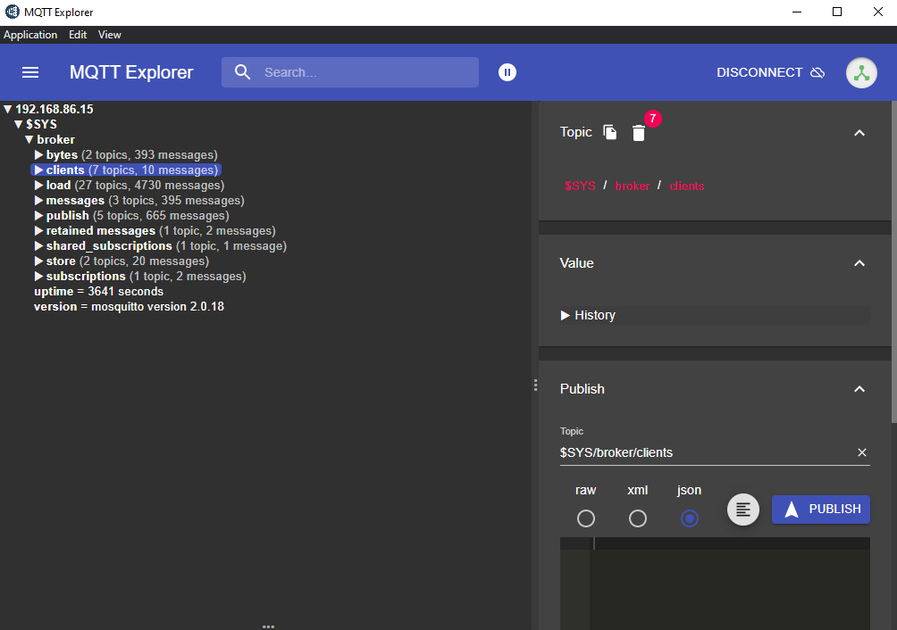

# Configuração do Broker MQTT Mosquitto no Raspberry Pi 3 usando Docker e Ubuntu 23.10

Este projeto é a primeira etapa de um projeto maior que estou fazendo.

Visando automatizar algumas funções dentro do meu quarto, esse broker funcionará como meu servidor local. Permitindo a comunicação via protocolo mqtt entre meus sensores e microcontroladores.

## Pré-requisitos

Instalação do Ubuntu no Raspberry Pi 3:

- Faça o download da imagem mais recente do Ubuntu para Raspberry Pi 3 no [site oficial](https://ubuntu.com/download/raspberry-pi).
- Siga as instruções de instalação fornecidas pelo Ubuntu para gravar a imagem em um cartão SD.
- Insira o cartão SD no Raspberry Pi 3 e ligue-o.

Instalação do Docker:
    Siga as [instruções de instalação do Docker para o Ubuntu](https://docs.docker.com/engine/install/ubuntu/) no Raspberry Pi 3.

## 1. Preparando o Ambiente

Para utilizar o Raspberry Pi 3 como servidor local, instalei a distribuição Ubuntu 23.10. Após a conclusão da instalação do Ubuntu e do Docker no Raspberry Pi 3, criei as pastas de configuração, log e data.

```bash
mkdir broker
cd broker
mkdir config data log
nano config/mosquitto.conf
```

## 2. Criando o Container

Optei por utilizar o broker Mosquitto devido à sua popularidade e documentação abrangente.

Crie um arquivo mosquitto.conf e adicione as seguintes configurações:
```bash
allow_anonymous false
listener 1883
listener 9001
protocol websockets
persistence true
password_file /mosquitto/config/pwfile
persistence_file mosquitto.db
````
Observação: Caso prefira, é possível gerar um containar sem autenticação. Apenas excluindo a linha do parâmetro password_file e definindo o parâmetro:
```bash 
allow_anonymous true
````
Crie um arquivo para os dados de autenticação dos usuários.

```bash 
touch config/pwfile
````
Na pasta raiz do container adicione o arquivo de configuração do container:

```bash 
cd ..
nano docker-compose.yml
````

Insira no arquivo docker-compose.yml as seguintes configurações:

```bash 
version: "3.8"
services:
  broker:
    image: eclipse-mosquitto
    container_name: [nome_do_container]
    ports:
      - 1883:1883
      - 9001:9001
    volumes:
      - ./config:/mosquitto/config:rw
      - ./data:/mosquitto/data:rw
      - ./log:/mosquitto/log:rw
volumes:
  config:
  data:
  log:
networks:
  default:
    name: broker-network
````

É possível encontrar outras configurações e a lista completa de parâmetros na documentação oficial do Docker.

## 3. Testando o Broker

Para iniciar o container, execute:

```bash 
sudo docker-compose -p broker_mosquitto up -d
````

Verifique se o container está funcionando corretamente:

```bash 
sudo docker ps
````


Agora, insira o código abaixo para abrir o container no terminal:

```bash 
docker exec -it [nome_do_container] sh
````
Para criar um novo usuário:

```bash 
mosquitto_passwd -c /mosquitto/config/pwfile [nome_do_usuario]
````



Reinicie o container para aplicar as alterações:

```bash 
sudo docker restart [nome_do_container]
````
## 4. Testando o Broker
Teste se o broker está funcionando usando um cliente MQTT, como o [MQTT Explorer](http://mqtt-explorer.com). Insira o endereço IP do seu broker, o usuário e a senha configurados. Se tudo estiver correto, você deve ser capaz de ver o seu container em execução.




